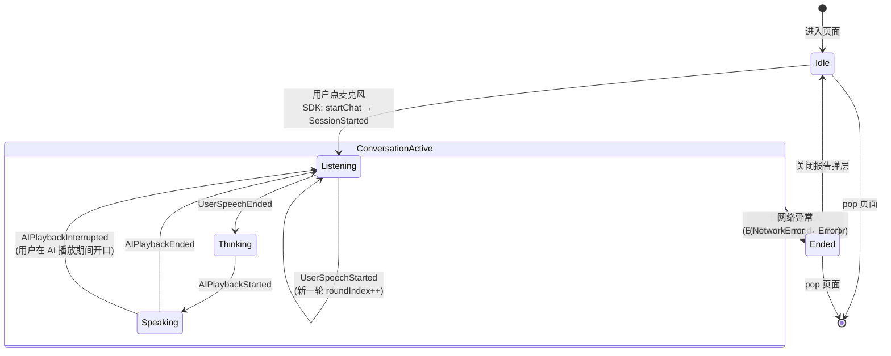
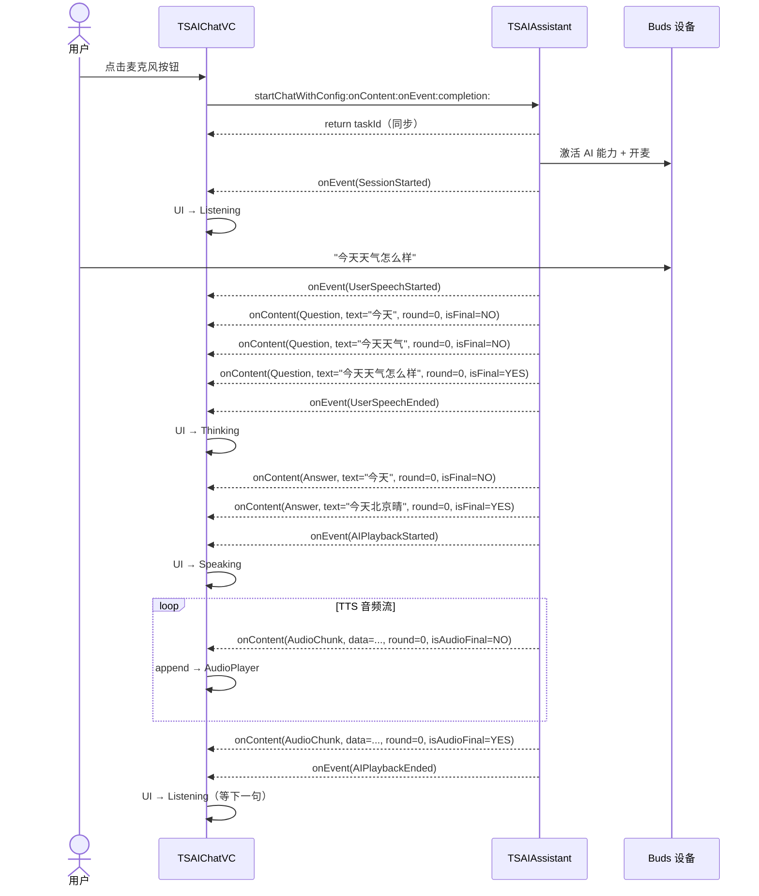
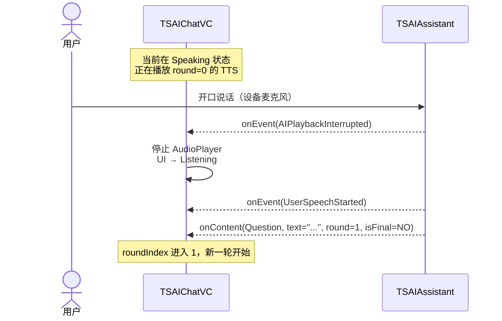
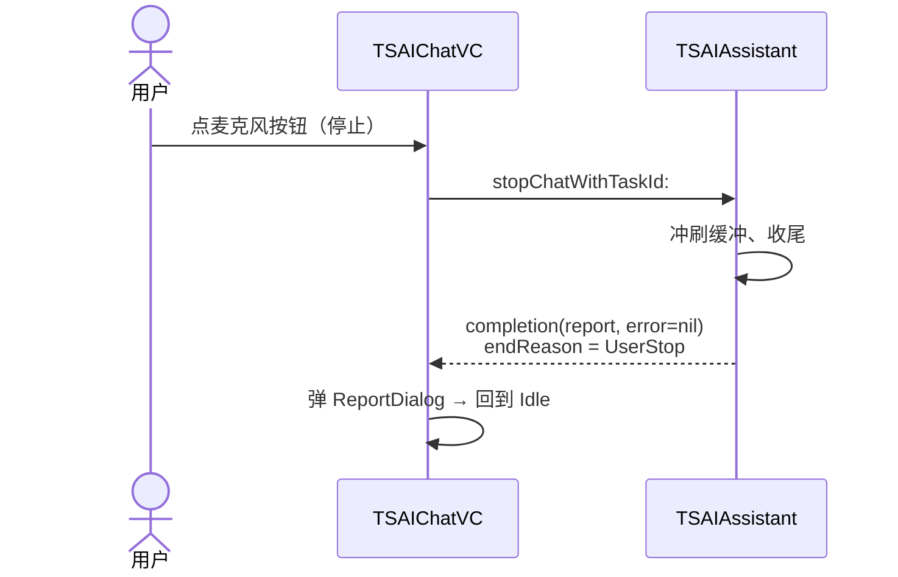
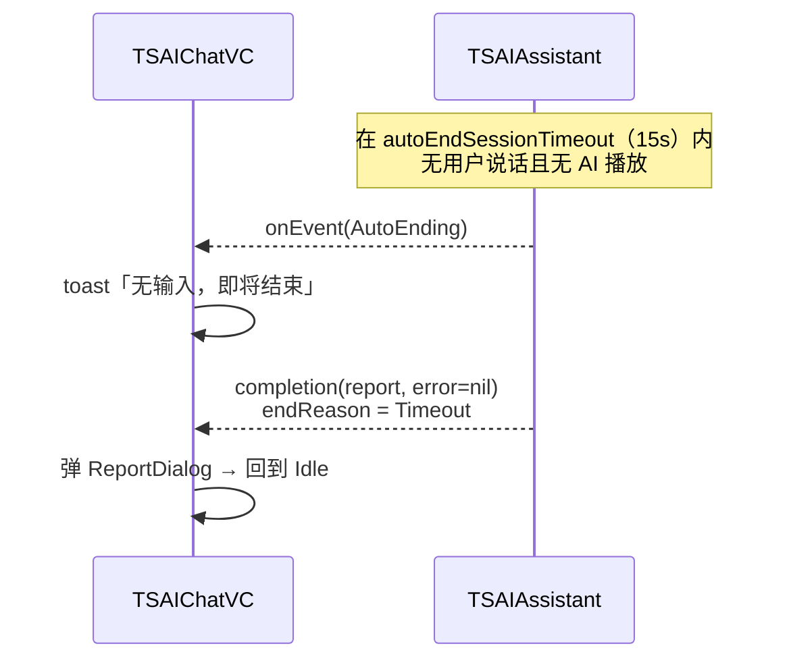
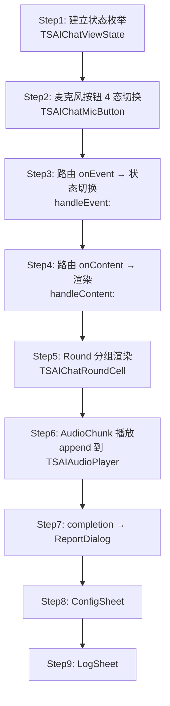

# TSAIChatVC 原型与交互（Prototype）

> 配合 [PRD.md](./PRD.md) 使用，本文聚焦：**状态机、回调时序、各页面线框**。
> 交互演示见 [demo.html](./demo.html)。

---

## 1. 整体状态机

会话的「**用户可感知状态**」由 `onEvent` + `completion` 驱动，UI 层只需关心这 5 个态。



> **不变量**：Listening / Thinking / Speaking 三态构成会话内的循环（即多轮问答），只有 stop / timeout / 错误 4 种触发能跳出循环到 Ended。

---

## 2. 典型时序图

### 2.1 正常一轮问答



### 2.2 用户打断 AI



### 2.3 主动结束



### 2.4 自动超时



---

## 3. 页面线框（ASCII）

### 3.1 主页 - Idle 空闲态

```
┌────────────────────────────────────────────┐
│  ←  AI 语音对话                       ⚙️   │  ← NavBar
├────────────────────────────────────────────┤
│                                            │
│                                            │
│                                            │
│                  ╭─────╮                   │
│                  │ 🤖  │                   │  ← 引导插图
│                  ╰─────╯                   │
│                                            │
│             点击下方按钮开始对话             │
│           说话时请贴近设备麦克风             │
│                                            │
│                                            │
│                                            │
│                                            │
│                                            │
├────────────────────────────────────────────┤
│                                            │
│              ╭───────────╮                 │
│              │           │                 │
│              │    🎤     │  ← 大圆按钮     │
│              │           │     (灰色)      │
│              ╰───────────╯                 │
│                                            │
│             点击开始对话                    │
│                                            │
│                                  [日志]    │
└────────────────────────────────────────────┘
```

### 3.2 主页 - Listening 聆听态

```
┌────────────────────────────────────────────┐
│  ←  AI 语音对话                       ⚙️   │
├────────────────────────────────────────────┤
│                                            │
│  ┌─────────────────────────────╮           │
│  │ Q  今天天气怎么样             │   round 0 │ ← 当前轮 Q 气泡
│  ╰─────────────────────────────╯           │     (实时刷新中)
│                                            │
│                                            │
│                                            │
│                                            │
│                                            │
│                                            │
│                                            │
│                                            │
│                                            │
├────────────────────────────────────────────┤
│                                            │
│          ╭───────────────╮                 │
│          │   ((  🎤  ))  │  ← 波纹动画      │
│          │   ((      ))  │     (蓝色)      │
│          ╰───────────────╯                 │
│                                            │
│             正在聆听…                       │
│                                            │
│                                  [日志]    │
└────────────────────────────────────────────┘
```

### 3.3 主页 - Thinking 思考态

```
┌────────────────────────────────────────────┐
│  ←  AI 语音对话                       ⚙️   │
├────────────────────────────────────────────┤
│                                            │
│  ┌─────────────────────────────╮           │
│  │ Q  今天天气怎么样             │   round 0 │ ← 已定稿(isTextFinal=YES)
│  ╰─────────────────────────────╯           │
│                                            │
│           ╭─────────╮                      │
│           │ ● ● ●   │  ← 三点闪烁          │
│           ╰─────────╯                      │
│                                            │
│                                            │
│                                            │
│                                            │
│                                            │
│                                            │
│                                            │
├────────────────────────────────────────────┤
│                                            │
│          ╭───────────────╮                 │
│          │      🎤       │  ← 暗色静态     │
│          ╰───────────────╯                 │
│                                            │
│             思考中…                         │
│                                            │
│                                  [日志]    │
└────────────────────────────────────────────┘
```

### 3.4 主页 - Speaking 回复态

```
┌────────────────────────────────────────────┐
│  ←  AI 语音对话                       ⚙️   │
├────────────────────────────────────────────┤
│                                            │
│  ┌─────────────────────────────╮           │
│  │ Q  今天天气怎么样             │   round 0 │
│  ╰─────────────────────────────╯           │
│                                            │
│           ╭─────────────────────────────┐  │
│   round 0 │ A  今天北京晴,最高22度…       │  │ ← 流式追加
│           ╰─────────────────────────────╯  │
│                                            │
│           ┌─ chip ──────────────────┐      │
│           │ 🔊 weather → 北京        │      │ ← Intent 命中
│           └─────────────────────────┘      │
│                                            │
│                                            │
│                                            │
│                                            │
├────────────────────────────────────────────┤
│                                            │
│          ╭───────────────╮                 │
│          │  ▁▂▅▇▅▂▁     │  ← 播放波形     │
│          │  (绿色)        │                 │
│          ╰───────────────╯                 │
│                                            │
│             回复中…（开口可打断）            │
│                                            │
│                                  [日志]    │
└────────────────────────────────────────────┘
```

### 3.5 主页 - 多轮滚动后

```
┌────────────────────────────────────────────┐
│  ←  AI 语音对话                       ⚙️   │
├────────────────────────────────────────────┤
│  ┌─────────────────────────────╮           │
│  │ Q  今天天气怎么样             │   round 0 │
│  ╰─────────────────────────────╯           │
│        ╭─────────────────────────────┐     │
│        │ A  今天北京晴,最高22度        │     │
│        ╰─────────────────────────────┘     │
│                                            │
│  ┌─────────────────────────────╮           │
│  │ Q  明天呢                     │   round 1 │
│  ╰─────────────────────────────╯           │
│        ╭─────────────────────────────┐     │
│        │ A  明天有小雨,记得带伞        │     │
│        ╰─────────────────────────────┘     │
│                                            │
│  ┌─────────────────────────────╮           │
│  │ Q  把音量调到 80              │   round 2 │
│  ╰─────────────────────────────╯           │
│        ╭─────────────────────────────┐     │
│        │ A  好的,已为您调整           │     │
│        ╰─────────────────────────────┘     │
│        ┌─ chip ────────────────────┐       │
│        │ 🔊 volumeControl → 80      │       │
│        └────────────────────────────┘       │
├────────────────────────────────────────────┤
│          ╭───────────────╮                 │
│          │     🎤        │                 │
│          ╰───────────────╯                 │
│             正在聆听…                       │
│                                  [日志]    │
└────────────────────────────────────────────┘
```

### 3.6 ConfigSheet（点 ⚙️ 进入）

```
┌────────────────────────────────────────────┐
│                                            │
│        ━━━━━ (拖拽指示器)                   │
│                                            │
│   会话配置                          [完成] │
│                                            │
│   语言提示       [ zh-CN          ▼ ]      │
│                                            │
│   Agent ID       [ ZNT002              ]   │
│                                            │
│   Speaker ID     [ xiaogang            ]   │
│                                            │
│   Initial Prompt                           │
│   ┌──────────────────────────────────────┐ │
│   │ User's name is John.                 │ │
│   │ User's location is Beijing.          │ │
│   │                                      │ │
│   └──────────────────────────────────────┘ │
│                                            │
│   语音输出                            [●○] │  ← enableVoiceOutput
│                                            │
│   允许打断                            [●○] │  ← allowUserInterrupt
│                                            │
│   断句静默阈值（秒）                        │
│   0.3 ─────●──────── 2.0     当前 0.8      │
│                                            │
│   无输入超时（秒）                          │
│   5  ───●─────────── 60      当前 15       │
│                                            │
│              [恢复默认]    [应用]           │
└────────────────────────────────────────────┘
```

### 3.7 LogSheet（点底部 [日志] 进入）

```
┌────────────────────────────────────────────┐
│                                            │
│        ━━━━━                                │
│   调试日志                          [关闭] │
│   ┌─────────────────┬──────────────────┐   │
│   │  Content (32)   │   Event (9)      │   │ ← 双 Tab
│   └─────────────────┴──────────────────┘   │
│                                            │
│   [Question  round=0]                      │
│   text: "今天天气怎么样"                   │
│   isFinal: YES   13:25:10.231              │
│   ────────────────────────────────────     │
│   [Answer    round=0]                      │
│   text: "今天北京晴,最高22度"              │
│   isFinal: YES   13:25:12.482              │
│   ────────────────────────────────────     │
│   [AudioChunk round=0]                     │
│   bytes: 3200  format: PCM 16k             │
│   isAudioFinal: NO   13:25:12.612          │
│   ────────────────────────────────────     │
│   [Intent    round=2]                      │
│   type: VolumeControl                      │
│   query: "把音量调到 80"                   │
│   value: "80"   13:25:30.011               │
│                                            │
│   ……                                       │
│                                            │
│        [复制最近 1 轮]   [清空]            │
└────────────────────────────────────────────┘
```

### 3.8 ReportDialog（会话结束）

```
        ┌──────────────────────────────┐
        │                              │
        │    ╭──────╮                  │
        │    │ ✓    │  会话结束        │
        │    ╰──────╯                  │
        │                              │
        │  结束原因   用户主动结束     │
        │  开始时间   13:25:10         │
        │  结束时间   13:26:48         │
        │  会话时长   1 分 38 秒        │
        │  问答轮次   3 轮              │
        │                              │
        │  TaskId                      │
        │  ┌────────────────────────┐  │
        │  │ 7B3F2A1C-...-D8E9      │  │ ← 长按复制
        │  └────────────────────────┘  │
        │                              │
        │      [复制 JSON]    [好的]    │
        └──────────────────────────────┘
```

---

## 4. 关键交互细节

### 4.1 麦克风按钮的 4 态视觉

| 状态 | 颜色 | 动效 | 文案 |
|------|------|------|------|
| Idle | 灰白底 + 深灰图标 | 静态 | 点击开始对话 |
| Listening | 蓝底 + 白图标 | 同心圆波纹由内向外扩散 | 正在聆听… |
| Thinking | 紫底 + 白图标 | 三点 1-2-3 顺序闪烁 | 思考中… |
| Speaking | 绿底 + 白波形 | 8 条音频柱随机起伏 | 回复中…（开口可打断） |

### 4.2 Q/A 气泡的样式

| 类型 | 位置 | 颜色 | 形状 |
|------|------|------|------|
| Q（用户问） | 左对齐 | 浅蓝底深蓝字 | 左上角小圆，右侧大圆 |
| A（AI 答） | 左偏移 16pt 缩进 | 浅灰底深灰字 | 右上角小圆，左侧大圆 |
| Intent chip | A 气泡下方对齐 | 黄色描边 | 胶囊形 |

> Q 与 A 都在左侧，**不模仿 IM 左右对称布局**。原因：这是「同一个人」（设备麦克风）的双向流，左右拉开会让多轮看起来混乱；用缩进区分更清晰。

### 4.3 文本流式刷新策略

- `Question` / `Answer` 都用 **整体赋值**（`label.text = content.text`），SDK 已保证 `text` 是累积文本，不要本地拼接。
- ASR 的 `Question` 在 `isTextFinal=NO` 阶段会修订（删字、改字），**直接整体替换**就能自动表现修订效果。
- 同一 `roundIndex` 的 Q/A 气泡固定复用 Cell，不重建。

### 4.4 音频播放策略

- 用一个 `TSAIAudioPlayer`（已存在于 `Common/`），格式按 `audioFormat` 切换，默认 16kHz / 16bit / mono / PCM-LE。
- 每收一个 `AudioChunk` **append** 到内部环形缓冲。
- 收到 `isAudioFinal=YES` 时**不要立刻 stop**，让缓冲自然播完。
- 收到 `AIPlaybackInterrupted` 立刻 stop + 清空缓冲。

### 4.5 错误横幅

```
┌────────────────────────────────────────────┐
│  ←  AI 语音对话                       ⚙️   │
├────────────────────────────────────────────┤
│  ⚠️  设备已断开，会话已结束                  │  ← 红色横幅，3s 自动消失
├────────────────────────────────────────────┤
│  ……                                        │
```

错误横幅与 ReportDialog 并存（横幅在顶，Dialog 居中），用户先看到原因再看报告。

---

## 5. 实现拆解（写代码时按此顺序）



每一步上一阶完成 + 真机自测后再进下一阶，避免最后端到端联调时无法定位问题。
